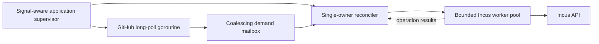

# Incus GitHub runner controller

## Position

Build a foreground Go service that turns GitHub runner scale-set demand into
short-lived Incus VMs. The service is normally supervised by systemd and owns
only the lifecycle of runner instances it created.

The controller assumes its Incus environment already exists. It does not
configure projects, networks, storage, profiles, firewalls, clustering, or host
security. It may ensure the selected runner image is locally available, then it
limits itself to discovering, creating, starting, inspecting, and deleting
explicitly owned runner instances.

This is a working proposal, not a frozen implementation specification. It
supersedes the zero-idle v1 boundary in `TECHNICAL_PROPOSAL.md`: hot standby
runners are required for v1, although a zero-idle single-runner spike remains
the simplest first proof.

## Working v1 decisions

- Use [`actions/scaleset`](https://github.com/actions/scaleset) for scale-set
  registration, long polling, demand statistics, message acknowledgement, and
  JIT runner configuration.
- Use [`github.com/lxc/incus/v7/client`](https://pkg.go.dev/github.com/lxc/incus/v7/client)
  for Incus access.
- Manage one configured scale set and one runner image per controller process.
- Maintain a configured floor of fully booted, JIT-registered, connected idle
  runners, capped by a configured maximum.
- Give every runner one JIT configuration, let it execute at most one job, and
  delete its VM after terminal poweroff.
- Recover lifecycle state from Incus ownership metadata and current scale-set
  demand rather than introducing a controller database.
- Keep orchestration independent of Cobra, Viper, systemd, GitHub, and Incus by
  preserving the template's hexagonal design.
- Run external work concurrently, but bound it. No unbounded goroutine per
  message or per desired runner.

The first implementation may revise these choices when a real Incus lifecycle
or GitHub assignment proves an assumption wrong.

## Runtime shape



The application supervisor owns the root context and all long-lived
goroutines. An `errgroup` or equivalent structure should make cancellation and
fatal error propagation explicit.

The scale-set listener invokes its scaler callbacks synchronously. Those
callbacks must not call Incus. They update or publish the latest demand and
return immediately so a slow VM operation never blocks GitHub polling.

The reconciler is the single owner of observed and desired runner state. It
responds to coalesced demand, worker results, and a periodic safety tick. It
schedules work into a bounded Incus worker pool and counts scheduled work as
in-flight capacity. This avoids duplicate provisioning without requiring
shared mutable state across worker goroutines.

## Hexagonal boundaries

The orchestration core should express runner lifecycle concepts rather than
third-party client types. Its initial ports are intentionally narrow:

- **Scale-set port:** receive current capacity demand, obtain a one-runner JIT
  configuration, and manage the GitHub message session.
- **Runner backend:** inventory owned runners and create, start, inspect,
  collect diagnostics for, and delete one runner.
- **Clock and identity:** supply time, deadlines, and unique instance names
  where deterministic tests need them.

Interfaces live beside the core code that consumes them. The GitHub and Incus
packages implement those interfaces as adapters; they do not leak their client
models into the controller.

A likely package shape is:

```text
cmd/incus-gh-runner/main.go   signal context and process exit
internal/cli/                 Cobra and Viper adapter
internal/config/              defaults, loading, validation, immutable config
internal/app/                 dependency composition and goroutine supervision
internal/controller/          reconciliation core and its ports
internal/adapters/github/     actions/scaleset adapter
internal/adapters/incus/      incus/v7 adapter
```

This tree is a starting hypothesis. The first two proof slices should be
allowed to collapse or split packages based on actual coupling.

## Capacity and runner lifecycle

For each scale-set statistics update, desired live capacity is:

```text
target = min(max_runners, min_runners + TotalAssignedJobs)
```

`min_runners` is the idle standby floor. A standby is hot only after its VM is
running and its JIT-configured runner is connected to GitHub. A booted but
unregistered VM does not meet the v1 latency goal.

The controller counts provisioning, booting, connected-idle, and busy owned
instances toward the target. Terminal, expired, and failed instances do not
count. It provisions only the deficit and does not scale down a VM running a
job. With static v1 capacity settings, excess capacity normally drains through
one-job completion rather than active eviction.

One runner proceeds through the following working lifecycle:

1. Reserve one capacity slot in reconciler state.
2. Obtain a fresh JIT configuration as late as practical.
3. Create an Incus VM from the configured image and profiles, attaching the
   controller's ownership metadata.
4. Inject the JIT material through the image contract and start the VM.
5. Observe bounded evidence of bootstrap and runner readiness.
6. Let the runner accept at most one GitHub job.
7. Let the guest power off after the runner process exits.
8. Collect available diagnostics and delete the stopped VM.
9. Reconcile again, creating a replacement when needed to restore the hot
   standby floor.

The exact JIT injection and readiness mechanisms remain joint controller/image
spike questions. They must not require the runner VM to receive GitHub App or
PAT credentials, nor access to the Incus socket.

## Reconciliation and restart recovery

The controller stores durable ownership state in Incus `user.*` instance
metadata. At minimum it needs controller/scale-set identity, creation time,
image version, and a log-safe correlation ID. A recognizable name prefix is
useful for operators but is not sufficient proof of ownership.

Startup inventories owned instances before scheduling new capacity. The
reconciler treats already provisioning, running, or busy instances as capacity,
deletes stopped instances, and applies a bootstrap deadline to instances that
never become usable. Partial create, start, and delete results are reconciled
idempotently.

The controller mutates only instances bearing its expected ownership marker.
It never performs broad project cleanup and never modifies unrelated Incus
infrastructure.

GitHub demand and Incus inventory are the recoverable sources of truth in v1.
Lifecycle messages are useful triggers and observability signals, but periodic
reconciliation must close gaps caused by process restarts, dropped messages,
or partially completed operations.

## Configuration

Extend the template's instance-scoped Viper setup, but use Viper only at the
CLI boundary. Load once at startup, validate into an immutable typed config,
and pass that config into the application. Hot reload and concurrent Viper
access are out of scope for v1.

Precedence is:

```text
flags > environment > configuration file > defaults
```

`--config <path>` selects an explicit file and fails if it cannot be read. With
no explicit flag, search for `/etc/incus-gh-runner/config.yaml`; its absence is
not itself fatal when environment variables and flags provide a complete
configuration.

Environment variables use the `INCUS_GH_RUNNER` prefix and stable underscore
names. Bind keys explicitly before unmarshalling so environment-only values do
not depend on Viper's known `AutomaticEnv`/`Unmarshal` edge cases.

A representative, deliberately small configuration is:

```yaml
github:
  config_url: https://github.com/meigma
  scale_set: incus-linux-x64
  runner_group: Default

incus:
  project: build-runners
  image: incus-gh-runner:v0.1.0
  profiles: [default, github-runner]

capacity:
  min_runners: 2
  max_runners: 10

concurrency:
  incus_operations: 4

timeouts:
  github_request: 5m
  incus_request: 30s
  incus_operation: 5m
  bootstrap: 5m
  shutdown: 30s

lifecycle:
  maximum_instance_age: 12h

retry:
  initial: 1s
  maximum: 30s
```

GitHub credentials remain separate from general configuration. A GitHub App is
the preferred production direction; a narrowly scoped token may be useful for
the first development spike. Private key material must not appear in command
arguments or logs. The exact environment, file-reference, or systemd credential
interface remains a deployment spike question.

## Reliability behavior

Normal long-poll expiry is not an error: the scale-set client returns no
message for a healthy HTTP 202 response, and the listener should poll again
immediately. Transport, API, or message-session failures should recreate the
session using capped exponential backoff with jitter, resetting the backoff
after successful contact.

Each Incus request and asynchronous operation gets a context deadline. Incus
operations use `WaitContext`; on deadline, the client attempts cancellation and
the controller later reconciles the resulting instance state. A failed runner
operation affects that runner, not the whole process: clean partial owned state
when safe and retry through normal demand reconciliation.

Go cannot forcibly kill a goroutine stuck inside a dependency. If a timed-out
operation does not return after a short hard grace period, the application
should return a fatal error and let systemd restart it rather than accumulating
wedged workers indefinitely.

Startup configuration, authentication, and preflight failures fail fast.
Transient GitHub or Incus failures after successful startup remain retryable.
Retry loops must honor cancellation and remain capped so shutdown is prompt.

## Signals and systemd

Keep the template's `signal.NotifyContext` handling for `SIGINT` and `SIGTERM`
and pass that context through Cobra into the application. On cancellation:

1. Stop GitHub polling and refuse new scheduling.
2. Stop accepting new Incus work.
3. Allow already-started operations a bounded shutdown period using a fresh
   context, since the root context is already canceled.
4. Close the message session and exit.

Ordinary service shutdown does not delete the persistent GitHub scale set or
kill active runner VMs. Existing VMs keep running their one-shot guest
lifecycle; the restarted controller inventories and reconciles them. The exact
policy for intentionally leaving idle runners during a long administrative
shutdown remains open.

The v1 unit should use `Type=simple`, run the process in the foreground, and
write structured logs to stdout/stderr for journald. Its basic policy is:

```ini
[Service]
Type=simple
ExecStart=/usr/bin/incus-gh-runner --config /etc/incus-gh-runner/config.yaml
Restart=on-failure
RestartSec=5s
KillSignal=SIGTERM
TimeoutStopSec=45s
```

The service identity needs the least privilege that can access the selected
Incus project/socket and GitHub credential. PID files, daemonization,
`Type=notify`, a systemd watchdog, and SIGHUP reload are not needed for the
first working service.

## Observability and sensitive data

Use `slog` structured events with stable scale-set, instance, operation, and
correlation fields. Record target, provisioning, idle, busy, terminal, and
failed counts plus provisioning latency. Metrics may follow after the lifecycle
works; logs are sufficient for the first proof.

Never log GitHub credentials or JIT configurations. Treat guest bootstrap data
and diagnostics as potentially sensitive, redact known secret fields, and
remove transient JIT material from the guest contract after use.

## Evidence-producing delivery slices

1. **Controller skeleton:** typed config, signal-aware supervisor, fake
   scale-set and runner ports, coalescing demand, single-owner reconciliation,
   and a bounded worker pool.
2. **Real Incus lifecycle:** use fake demand and a pre-imported image to create,
   start, observe poweroff, and delete one owned VM with timeouts.
3. **One real GitHub job:** use the real scale-set adapter with
   `min_runners: 0` and `max_runners: 1`; prove one JIT runner executes one job
   and returns to zero.
4. **Hot standby:** use `min_runners: 1`; prove the runner is connected before
   demand, receives a job quickly, and is replaced after completion.
5. **Recovery and supervision:** interrupt polling and Incus operations,
   restart during provisioning and execution, and send SIGTERM under systemd.

Each slice should produce a functional test or repeatable operator script and
may revise this proposal. Multiple scale sets, dynamic reload, remote Incus
transport, broad metrics, and sophisticated scheduling wait until these proofs
show a need.

## v1 acceptance

The v1 controller is credible when it can demonstrate that:

- it maintains `min_runners` fully connected idle runners without exceeding
  `max_runners`;
- GitHub polling remains responsive while Incus operations are in flight;
- one standby accepts at most one job, powers off, is deleted, and is replaced;
- a transient GitHub failure recovers with bounded backoff;
- Incus deadlines prevent an operation from being waited on forever;
- restart neither duplicates capacity nor destroys an active job;
- SIGTERM produces a bounded clean exit without terminating active runners;
- only instances carrying the controller's ownership marker are mutated; and
- a controller-compliant operator image works without using the repository's
  optional reference image.

## Open questions for the spikes

- Which JIT injection, readiness, and diagnostic mechanisms form the smallest
  reliable controller/image contract?
- Which exact GitHub App and development-token configuration should the first
  CLI support?
- Is context cancellation plus process restart sufficient for every observed
  hung Incus operation, or is a stronger systemd watchdog useful?
- Should deliberate long shutdowns remove idle runners while preserving busy
  runners, and how should that be distinguished from a restart?
- Does the first deployment need systemd credential loading, or is a protected
  credential file reference sufficient?

## References

- [`actions/scaleset` listener callback behavior](https://github.com/actions/scaleset/blob/9b2803251ede77816509dcd90aadc0690dd80763/listener/listener.go)
- [`actions/scaleset` message-session behavior](https://github.com/actions/scaleset/blob/9b2803251ede77816509dcd90aadc0690dd80763/session_client.go)
- [`actions/scaleset` retry and timeout defaults](https://github.com/actions/scaleset/blob/9b2803251ede77816509dcd90aadc0690dd80763/common_client.go)
- [Incus context-aware client](https://github.com/lxc/incus/blob/f51548a26a779390aefaec3d7b184ec97d5c5177/client/incus.go#L524)
- [Incus operation cancellation](https://github.com/lxc/incus/blob/f51548a26a779390aefaec3d7b184ec97d5c5177/client/operations.go#L128)
- [GitHub JIT runner security guidance](https://docs.github.com/en/actions/reference/security/secure-use#using-just-in-time-runners)
- [Viper configuration precedence](https://github.com/spf13/viper#why-viper)
- [systemd service behavior](https://www.freedesktop.org/software/systemd/man/latest/systemd.service.html)
