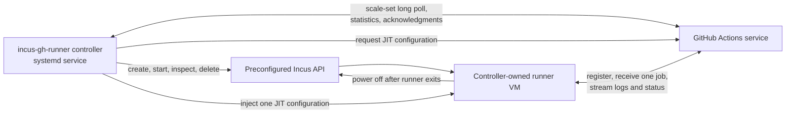

# Incus-backed GitHub Actions runner controller

This document records the working v1 design for `incus-gh-runner`. It is a
proposal, not a frozen specification: the first end-to-end prototype should be
allowed to replace assumptions with observed behavior.

## Decision summary

Deliver two artifacts from this repository:

1. A long-running Go controller, normally supervised by systemd, that uses
   GitHub's runner scale-set protocol to turn assigned job demand into
   short-lived Incus runner instances.
2. A versioned Incus VM image containing the GitHub Actions runner and a
   one-shot guest bootstrap, published with releases and independently usable
   by operators.

Build the controller around:

- [`github.com/actions/scaleset`](https://github.com/actions/scaleset) for
  scale-set registration, message polling, demand statistics, acknowledgments,
  authentication refresh, and per-runner JIT configuration.
- [`github.com/lxc/incus/v7/client`](https://pkg.go.dev/github.com/lxc/incus/v7/client)
  for image lookup/import and the create, start, inspect, stop, and delete
  operations needed for controller-owned instances.

The controller is deliberately not an Incus environment manager. Projects,
profiles, networks, storage pools, cluster placement, trust, firewalling, and
host hardening must already exist.

## Goals

- Serve one configured GitHub runner scale set from one preconfigured Incus
  environment.
- Long-poll GitHub for assigned demand and report a configured maximum
  capacity.
- Start one clean runner instance for each required unit of capacity, bounded
  by that maximum.
- Give each instance only its JIT runner configuration, never the controller's
  GitHub App or PAT credential.
- Run at most one GitHub Actions job per instance.
- Remove the instance after the runner exits, including after cancellation or
  failure.
- Recover controller-owned lifecycle state after a controller or host-service
  restart without a separate database.
- Optionally ensure the configured runner image is locally available before
  accepting work.

## Non-goals

- Creating or modifying Incus projects, profiles, networks, storage pools,
  ACLs, firewall rules, certificates, or cluster membership.
- General-purpose Incus orchestration or cleanup of instances not created by
  this controller.
- Kubernetes or Actions Runner Controller compatibility.
- Webhook-driven scaling.
- Persistent or multi-job runners.
- A warm runner pool in the first end-to-end slice; v1 starts at zero when
  idle.
- Multiple scale sets, heterogeneous images, or cross-host scheduling inside
  one controller process.
- Defining the workload toolchain beyond the minimum contract of the runner
  image.

## System context



The controller and runner make separate outbound connections to GitHub. GitHub
assigns demand to the scale set before a runner exists; after a runner starts
and registers, GitHub assigns a compatible pending job to an idle runner. A JIT
configuration creates eligible capacity, not a reservation for a specific job.

## Controller lifecycle

### Startup

1. Load and validate configuration and credentials.
2. Connect to the existing Incus environment and select the configured project.
3. Verify that required profiles and the image reference are usable, without
   modifying environment infrastructure.
4. If image preloading is enabled and the image is absent, obtain and import or
   copy it; otherwise fail fast with an actionable error.
5. Discover instances marked as owned by this controller and reconcile obvious
   terminal or expired instances.
6. Create or resolve the GitHub runner scale set and begin its message session.

### Demand loop

The scale-set listener reports `maxRunners` and long-polls for messages. Scaling
uses the response's current `statistics.TotalAssignedJobs`, not a count of
individual job messages. The desired number of live runner instances is:

```text
min(TotalAssignedJobs, maxRunners)
```

The controller compares that desired count with usable controller-owned
instances and creates only the deficit. Message-session mechanics and
acknowledgment stay inside the `actions/scaleset` adapter.

### Provisioning one runner

1. Allocate a unique instance name and attach ownership metadata.
2. Request a fresh JIT configuration as late as practical.
3. Create a VM from the pinned image and configured profiles.
4. Pass the JIT configuration through the image's bootstrap contract.
5. Start the VM and wait for bounded evidence that bootstrap has begun.
6. Count the VM as capacity while it is starting, online, or running a job so a
   slow boot does not cause duplicate provisioning.

The first prototype should choose the simplest Incus-supported injection
mechanism that proves the lifecycle. The durable contract is only that the
guest receives the JIT configuration at runtime and starts:

```bash
./run.sh --jitconfig "$JIT_CONFIG"
```

Cloud-init, an Incus-agent file push, or an image template can satisfy that
contract. The prototype should measure reliability and secret residue before
the mechanism is promoted to a v1 decision.

### Completion and deletion

The guest bootstrap runs the Actions runner once and powers off after the
runner process exits. GitHub automatically deregisters the one-job runner. The
controller treats a stopped owned instance as terminal, captures the available
diagnostic metadata, and deletes it from Incus.

This guest-driven poweroff gives the host controller a durable completion
signal even if the controller restarts while a job is running.

### Shutdown

On service shutdown, stop accepting new demand and finish in-flight Incus API
operations. Do not destroy running job instances merely because the controller
is stopping; their guest bootstrap can finish and power off, and the next
controller start will reconcile them.

## Ownership and reconciliation

Every created instance must have both a recognizable name prefix and Incus
`user.*` metadata identifying at least:

- the controller and scale-set identity;
- the creation time;
- the intended runner/image version; and
- a correlation identifier that is safe to log.

Only instances carrying the expected ownership marker are mutable. The
controller must never infer ownership from a broad project listing alone.

The reconciler has no external database in v1. It rebuilds state from Incus,
the scale-set statistics, and lifecycle messages. It handles:

- stopped owned instances by deleting them;
- failed or never-booted instances with a provisioning deadline;
- running instances by leaving them in place unless their bounded lifetime has
  expired;
- controller restarts without creating replacement capacity for already
  starting or running instances; and
- partial create/start/delete operations idempotently.

GitHub's eventual removal of unused JIT runner records is a safety net, not the
controller's primary instance cleanup mechanism.

## Internal architecture

Keep the orchestration core independent of both third-party clients. The first
implementation needs three narrow boundaries:

- **Demand source**: supplies current desired capacity and produces a fresh JIT
  configuration for an accepted runner allocation.
- **Runner backend**: lists owned instances and creates, starts, inspects, and
  deletes a runner instance.
- **Controller clock/identity**: supplies deadlines and unique names so
  reconciliation is deterministic in tests.

Adapters wrap `actions/scaleset` and `incus/v7/client`. Interfaces belong with
the orchestration code that consumes them. Configuration, logging, signal
handling, and systemd wiring remain at the application edge.

This is a set of seams, not a mandated package tree. Let the initial prototype
show where packages want to split before committing to a larger hierarchy.

## Configuration boundary

The initial configuration should express intent, not reproduce the Incus API:

```yaml
github:
  config_url: https://github.com/meigma
  scale_set: incus-linux-x64
  runner_group: Default

incus:
  project: build-runners
  image: incus-gh-runner:v0.1.0
  profiles: [default, github-runner]

capacity:
  max_runners: 4

lifecycle:
  provision_timeout: 5m
  maximum_instance_age: 12h
```

Credentials are supplied separately from this file. The first slice should use
the local Incus Unix socket; remote Incus authentication can be added when a
real deployment requires it.

Configuration references existing Incus objects but never declares their
desired configuration. Missing objects are preflight errors.

## Runner image

The image is a separate build and release concern. Its minimum contract is:

- an Incus VM image for the supported host architecture;
- a pinned, supported GitHub Actions runner binary;
- a one-shot bootstrap that accepts one JIT configuration;
- no embedded GitHub registration or administrator credentials;
- runner diagnostics available to the host before deletion; and
- automatic poweroff after the runner process exits.

The working distribution choice is a versioned unified Incus image tarball plus
checksum in each GitHub release. Incus documents unified tarballs as the simpler
Incus-specific format, with a `qcow2` `rootfs.img` for VM images. The operator
can import the asset ahead of time and configure its local alias or fingerprint.

Optional image readiness remains intentionally narrow:

- If the configured local image exists, use it.
- If it is absent and a source is configured, download/copy, verify, and import
  that one image.
- If it is absent with no source, fail startup.

A short spike must validate release-asset size, import time, and the exact URL
download flow. Incus direct URL import requires image-specific HTTP headers, so
downloading with the controller and importing the local file may be the simpler
GitHub Releases path.

The image's workflow toolchain is deliberately not fixed here. Begin with what
is required for one real repository workflow, then add tools based on observed
needs rather than trying to reproduce a GitHub-hosted image upfront.

## Systemd operating model

The controller runs as a foreground process under `Type=simple` and relies on
systemd restart policy for process supervision. The service identity needs
access to the Incus socket and to the GitHub credential, but the spawned runner
VM must have access to neither.

Operational expectations:

- readiness is reached only after GitHub and Incus preflight succeeds;
- termination is graceful and does not kill active jobs;
- structured logs use stable runner/instance correlation fields;
- JIT configurations and GitHub credentials are always redacted; and
- runner/console diagnostics are exported before instance deletion when
  available.

Metrics can follow after the lifecycle works. Useful first signals are desired,
starting, running, stopped, failed, and deleted runner counts plus provisioning
latency.

## Failure behavior

| Failure | v1 behavior |
|---|---|
| GitHub unavailable | Keep existing runner instances; retry the listener with bounded backoff. |
| Incus unavailable | Do not acknowledge new usable capacity; retry without altering desired infrastructure. |
| Image missing | Preload the configured source or fail preflight. |
| VM creation/start fails | Mark the allocation failed, delete partial owned state, and allow demand reconciliation to retry. |
| VM never bootstraps | Delete it after `provision_timeout`; request a new JIT configuration for any replacement. |
| Runner/job exits | Guest powers off; controller captures diagnostics and deletes the VM. |
| Controller restarts | Rediscover owned instances before provisioning deficits. |
| Delete fails | Retain the ownership marker and retry reconciliation; never broaden cleanup. |

## Delivery slices

The implementation should proceed as evidence-producing slices:

1. **Incus lifecycle spike**: with fake demand and a pre-imported image, create
   one VM, pass a disposable payload, observe poweroff, and delete it with zero
   residue.
2. **One real job**: add `actions/scaleset`, set `max_runners: 1`, execute one
   workflow job through JIT registration, and return to zero instances.
3. **Recovery**: restart the controller during provisioning and during a job;
   prove it neither duplicates nor destroys active capacity.
4. **Image release**: make the proven guest image reproducible and publish the
   unified image plus checksum as a release asset.
5. **Bounded concurrency**: raise the maximum and prove multiple jobs converge
   correctly before adding more scheduling features.

Each slice may revise this document. Do not build warm pools, remote Incus
transport, multi-scale-set configuration, or broad observability before the
single-runner lifecycle works.

## v1 acceptance

The v1 boundary is satisfied when:

- a queued job for the configured scale set causes exactly one owned Incus VM
  to be created within the configured capacity limit;
- the VM registers with only its JIT configuration and executes no more than
  one job;
- normal completion returns both GitHub runner state and Incus instance count
  to zero;
- cancellation, failed boot, and controller restart leave no permanent owned
  instance residue;
- the controller never mutates unowned instances or Incus infrastructure; and
- the released image can be imported into a prepared Incus environment and
  used without rebuilding it locally.

## Open questions for the first spikes

- VM versus system container: v1 assumes a VM for the stronger workload
  boundary; measure whether its startup latency is acceptable before fixing the
  choice permanently.
- Which JIT injection mechanism gives the smallest reliable guest contract and
  least secret residue?
- Does a unified VM image remain a practical GitHub Release asset at the
  resulting size, or should distribution move to an Incus image server later?
- What minimum tools are required by the first real workflow chosen for the
  end-to-end proof?
- Which runner/console logs can be collected reliably after guest poweroff but
  before instance deletion?

## References

- [GitHub Actions Runner Scale Set Client](https://github.com/actions/scaleset)
- [GitHub self-hosted runners reference](https://docs.github.com/en/actions/reference/runners/self-hosted-runners)
- [GitHub JIT runner security guidance](https://docs.github.com/en/actions/reference/security/secure-use#using-just-in-time-runners)
- [Incus Go client](https://pkg.go.dev/github.com/lxc/incus/v7/client)
- [Incus image format](https://linuxcontainers.org/incus/docs/main/reference/image_format/)
- [Incus image import and copy](https://linuxcontainers.org/incus/docs/main/howto/images_copy/)
